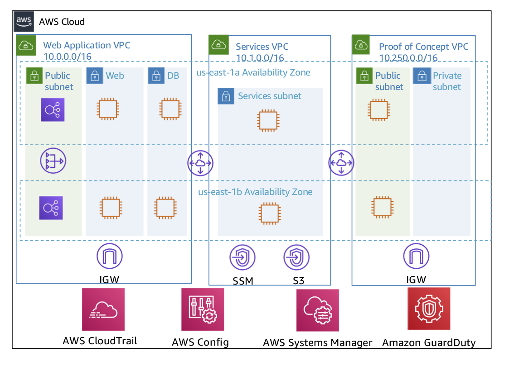

# Overview

Whether you are migrating existing workloads or creating something new in AWS, it can be tempting to bring your current security solutions with you. In this hands-on workshop, we help you identify which cloud-native solutions can mitigate the same risks while providing scalability, reliability, and cost optimization at a low operational burden. During this workshop, you will learn how to use cloud native controls like CloudTrail, Security Groups, GuardDuty and many more, to secure your cloud architecture.

* **Level**: Intermediate
* **Duration**: 1 hour
* **<a href="https://awssecworkshops.com/getting-started/" target="_blank">Prerequisites</a>**: AWS Account, Admin IAM User
* **<a href="https://www.nist.gov/cyberframework/online-learning/components-framework" target="_blank">CSF Functions</a>**: Prevent, Detect 
* **<a href="https://d0.awsstatic.com/whitepapers/AWS_CAF_Security_Perspective.pdf" target="_blank">CAF Components</a>**: Preventative, Detective for Logging and Monitoring and Infrastructure Security
* **AWS Services**: Amazon CloudWatch, Amazon GuardDuty, AWS CloudTrail, AWS Config, Security Groups, Network ACLs

## Scenario 
For this workshop, you will be securing an architecture that was a "refactored" migration from a traditional three tier on premise architecture. 

The network has two internet facing VPCs - one VPC for the Web Application and one sandbox for the developers called the Proof of Concept VPC. Additionally, there is a Services VPC that allows administrators to manage the network. 

## Architecture 

## Presentation Deck  
[Workshop Presentation Deck](./amazon-ec2-native-infrastructure-security-workshop.pdf)

## Region

This workshop has been tested in *us-east-1*, *us-east-2*, and *us-west-1*

First you'll want to [Set up](./setup.md) your environment for this lab by running CloudFormation.

Then you will perform multiple steps that will guide you through different security tasks.  These steps will have you diving deep into two of the Core Epics of the Cloud Adoption Framework, namely "Logging and Monitoring" and "Infrastructure Security":

1.    [Enable granular logging](./labsteps.md#enable-granular-logging-to-see-everything-in-your-aws-environment)
2.    [Improve granular control of communication](./labsteps.md#granular-provable-control-of-communications)
3.    [Improve granular network-based controls](./labsteps.md#when-security-includes-explicitly-denying-network-access)
4.    [Evaluate detailed logging capabilities](./labsteps.md#logging-actions-in-your-environment-and-making-it-easy-to-see-whats-changed)
5.    [Evaluate network-based protections](./labsteps.md#logging-and-monitoring-of-the-network-for-bad-behavior-is-important-too)
6.    [Minimize admin access risk](./labsteps.md#reducing-the-risk-of-admin-access-and-administrative-ports)

If you complete all six steps with time to spare, there is [Extra Credit](./extracredit.md) available.

Finally, make sure to [Clean up](./cleanup.md) your environment to ensure you don't have any continuing charges.

Many of the steps in this lab are written in general steps. This is intentional - we want you to learn the AWS interface, so we will not always specify each necessary click to accomplish a task.  We've written more of a guide than a tutorial. Please don’t hesitate to ask questions.
